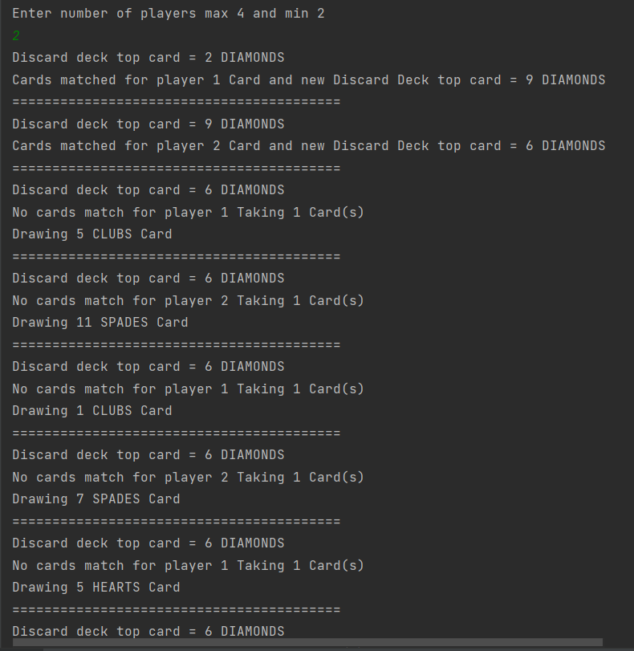
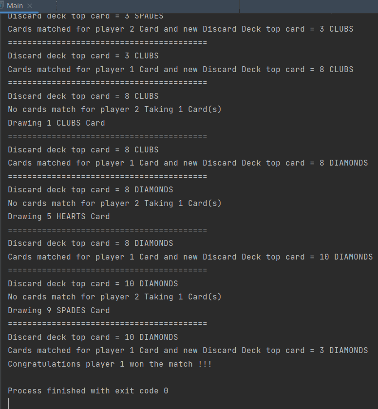

#Swiggy Coding Test

Multiplayer card game with upto 4 players

## How to run the program.

Simply clone this repository on your local system and execute the Main class' main method --> (Main.main()) and give input 
on how many players you want the game to play for minimum = 2
and maximum = 4.

Runs on any kind of Environment which supports Java 1.8 or above.

Thank you!
## Screenshots

## Author

- [Mrityunjay Sarkar](https://github.com/MrityuNJ45)

## Contact Me

- [LinkedIn](https://www.linkedin.com/in/mrityunjay-sarkar45/)
- Email : mrityunjaysorcar@gmail.com
